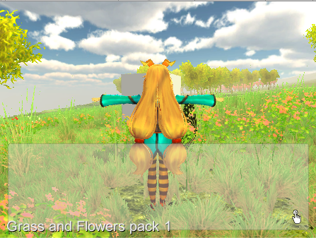
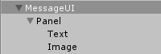
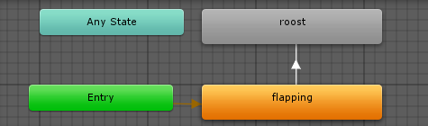
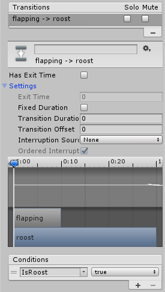
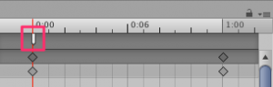

<!-- MarkdownTOC autolink="true" -->

- [作りたいもの](#%E4%BD%9C%E3%82%8A%E3%81%9F%E3%81%84%E3%82%82%E3%81%AE)
- [実装中](#%E5%AE%9F%E8%A3%85%E4%B8%AD)
- [GameObject.Find](#gameobjectfind)
- [Example Scene](#example-scene)
- [蝶オブジェクトの構成要素](#%E8%9D%B6%E3%82%AA%E3%83%96%E3%82%B8%E3%82%A7%E3%82%AF%E3%83%88%E3%81%AE%E6%A7%8B%E6%88%90%E8%A6%81%E7%B4%A0)
- [メッセージGUI](#%E3%83%A1%E3%83%83%E3%82%BB%E3%83%BC%E3%82%B8gui)
    - [外観](#%E5%A4%96%E8%A6%B3)
    - [実装](#%E5%AE%9F%E8%A3%85)
    - [Event Triggerによる実装](#event-trigger%E3%81%AB%E3%82%88%E3%82%8B%E5%AE%9F%E8%A3%85)
- [蝶の動き](#%E8%9D%B6%E3%81%AE%E5%8B%95%E3%81%8D)
    - [移動の実装](#%E7%A7%BB%E5%8B%95%E3%81%AE%E5%AE%9F%E8%A3%85)
    - [ひらひらする動きの実装](#%E3%81%B2%E3%82%89%E3%81%B2%E3%82%89%E3%81%99%E3%82%8B%E5%8B%95%E3%81%8D%E3%81%AE%E5%AE%9F%E8%A3%85)
        - [エラー内容 AnimationEvent has no function name specified!](#%E3%82%A8%E3%83%A9%E3%83%BC%E5%86%85%E5%AE%B9-animationevent-has-no-function-name-specified)
    - [Asset作り](#asset%E4%BD%9C%E3%82%8A)
- [ゲーム空間のカメラ機能](#%E3%82%B2%E3%83%BC%E3%83%A0%E7%A9%BA%E9%96%93%E3%81%AE%E3%82%AB%E3%83%A1%E3%83%A9%E6%A9%9F%E8%83%BD)
    - [仕様](#%E4%BB%95%E6%A7%98)
        - [メインカメラ](#%E3%83%A1%E3%82%A4%E3%83%B3%E3%82%AB%E3%83%A1%E3%83%A9)
        - [主観カメラ](#%E4%B8%BB%E8%A6%B3%E3%82%AB%E3%83%A1%E3%83%A9)
        - [切替時のカメラ挙動](#%E5%88%87%E6%9B%BF%E6%99%82%E3%81%AE%E3%82%AB%E3%83%A1%E3%83%A9%E6%8C%99%E5%8B%95)
        - [カメラのズームイン・ズームアウト](#%E3%82%AB%E3%83%A1%E3%83%A9%E3%81%AE%E3%82%BA%E3%83%BC%E3%83%A0%E3%82%A4%E3%83%B3%E3%83%BB%E3%82%BA%E3%83%BC%E3%83%A0%E3%82%A2%E3%82%A6%E3%83%88)
        - [カメラからスクリーンショット](#%E3%82%AB%E3%83%A1%E3%83%A9%E3%81%8B%E3%82%89%E3%82%B9%E3%82%AF%E3%83%AA%E3%83%BC%E3%83%B3%E3%82%B7%E3%83%A7%E3%83%83%E3%83%88)
- [Unityちゃんの挙動](#unity%E3%81%A1%E3%82%83%E3%82%93%E3%81%AE%E6%8C%99%E5%8B%95)

<!-- /MarkdownTOC -->

# 作りたいもの
手に蝶が乗ってひらひらする  
https://twitter.com/SIitherinn/status/983708984812167168  
これをGW開けまでに作る.  

# 実装中
1. 蝶をクリックすると説明が出る.  
1. 蝶がひらひら動く.  

# GameObject.Find
Hierarchyから引数と同じ名前のオブジェクトを取得する.  

    例
    GameObject messagepanel;
    messagepanel = GameObject.Find( "ActiveMessagePanel" )
    とすると、messagepanelにActiveMessagePanelのオブジェクトが参照され格納される.

# Example Scene
Grass and Flower pack 1のシーン  
これにオブジェクトを設置して作っている  

# 蝶オブジェクトの構成要素
1. Animation
1. Rigidbody
1. Sphere Collider
1. Cube Control(仮名)
クリックしたらメッセージを出す.  

# メッセージGUI

## 外観  
  
階層構造はこんなかんじ  
  

パラメータ:  

    Panel
    stretch-stretch
    Left 10, Top 200, Pos Z 0
    Right 10, Bottom 10

    Text
    stretch-stretch
    Left 10, Top 10, Pos Z 10
    Right 10, Bottom 10

    Image
    stretch-stretch
    Left 400, Top 95, Pos Z 0
    Right 10, Bottom 10
参考: https://gametukurikata.com/program/rpgmessage  

## 実装
ActiveMessagePanel.cs

    using UnityEngine;
    using System.Collections;
    public class ActiveMessagePanel : MonoBehaviour {
        //　MessageUIに設定されているMessageスクリプトを設定
        [SerializeField]
        private Message messageScript;
        private GameObject refObj;
        public string cubeTag="Cube";
        Ray ray;
        RaycastHit hit = new RaycastHit();
        // Update is called once per frame
        void Update () {
            if (Input.GetMouseButtonDown(0))
            {
                ray = Camera.main.ScreenPointToRay(Input.mousePosition);
                //マウスクリックした場所からRayを飛ばし、オブジェクトがあればtrue 
                if (Physics.Raycast(ray.origin, ray.direction, out hit, Mathf.Infinity))
                {
                    if(hit.collider.gameObject.CompareTag(cubeTag))
                    {
                        // cubeControlクラスにmessageScriptオブジェクトを渡して，定められたメッセージを表示する.
                        hit.collider.gameObject.GetComponent<CubeControl>().OnUserAction(messageScript);
                    }
                }
            }
        }
    }

CubeControl.cs

    using UnityEngine;
    using System.Collections;
    [RequireComponent(typeof(Rigidbody))]
    public class CubeControl : MonoBehaviour {
        private string message = "テストメッセージ\n"
        + "ここに種ごとの説明が入る予定\n";
        public void OnUserAction(Message messageScript)
        {
            messageScript.SetMessagePanel(message);
        }
    }

## Event Triggerによる実装
http://tech.pjin.jp/blog/2017/09/03/unity_event-trigger/  
注意：クラス名とファイル名，アセット名はすべて同じにしなければならない？  
EventTriggerTest.csをbutterflyに設定してDebug.Logでメッセージを出そうとしてもうまくいかない  
カメラから見て画面手前にあるPanelに同じことをするとDebug.Logのメッセージが表示される.  
つまり，EventTriggerがPanelに反応してしまい，奥のbutterflyにイベント判定が向かない？  
今のところは，Colliderを手書きしてやる必要がありそう．  
ソースコードが煩雑になるが，今の所他に手はない.  

# 蝶の動き
Control.csのUpdateで以下のように，変更すれば位置を変更できる．

    絶対位置
    this.transform.position += new Vector3(x, y, z);
    相対位置
    this.transform.localPosition += new Vector3(x, y, z);

Unityのランダムは以下のように用いる．

    float x = Random.Range(-0.1f, 0.1f);

向いている方向に移動する

    this.transform.rotation = Quaternion.LookRotation(new Vector3(x, y, -z));
    this.transform.position += new Vector3(x, y, z);

    [Reference]
    Quaternion.Slerp(quaternion rot1, quaternion rot2, float vel)
    rot1からrot2へ球形にクオータニオンを補間し，なめらかに方向転換させる．しかし，外力が加わったとき回転が不安定になりやすい．
    Quaternion.LookRotation(Vector3 forward, Vector3 upwards)
    forwardをZ+方向に，upwardsをY+方向に変換するクオータニオンを返す

## 移動の実装
グローバルな移動と，ローカルな移動を組み合わせる．  
グローバルな移動は関数による実装，ローカルな移動はアニメーションで実装する.  

## ひらひらする動きの実装
http://indie-du.com/entry/2016/05/15/090000  
メッシュモデル，関節などを設定したあと，unityでキーフレームを設定することで動きを作れるっぽい  https://techacademy.jp/magazine/9284  
Animationの作り方  
http://www.atmarkit.co.jp/ait/articles/1411/20/news045_2.html

・ 座標(x, y, z)に進み，止まる動きを実装  
[animation]  
移動中:flapping_A  
静止中:flapping_B  

[animator]  
  
  
目的地に近づき一定距離以内になったとき，IsRoostがtrueになりflappingからroostに遷移する  

### エラー内容 AnimationEvent has no function name specified!
  
AnimationEventに関数を設定することで，そのタイミングで関数を呼び出すことができる.  
AnimationEventを作っておいて，それに関数を設定しなければこのエラーが出る.  

## Asset作り
人形モデル  
メッシュモデルを作ってBlenderで関節を埋め込んで動かす.  
全体 http://takashicompany.hatenablog.com/entry/2013/11/10/215814
Blender使い方 http://nn-hokuson.hatenablog.com/entry/2017/10/03/205639  
Blenderハマりポイント https://twitter.com/HomeMasisi/status/633614935897968641  
結局できていない

# ゲーム空間のカメラ機能
## 仕様

    フィールド移動時：三人称視点(メインカメラ)
    撮影時：一人称視点(主観カメラ)
    [概要]
    メインカメラからの視点をもとにユーザはフィールドを移動し，撮影対象にアプローチする．
    その後，ユーザは主観カメラに切り替えて，撮影位置を微調整し，撮影する．

### メインカメラ
キャラクタの後ろ斜め上から，風景とキャラクタを見下ろすように同時に写すカメラ．  
[操作]  
↑：前方移動  
↓：後方移動  
→：右回転  
←：左回転  
Space：主観カメラへの切り替え  
左クリック：対象物の説明を表示  
右ドラッグ：カメラをキャラクタを中心に回転(キャラクタは回転しない)  

### 主観カメラ
キャラクタの主観視点カメラ  
カメラ撮影用  
[操作]  
↑：前方移動  
↓：後方移動  
→：右移動  
←：左移動  
Ctl+↑：仰角を上げる  
Ctl+↓：仰角を下げる  
Ctl+→：右を向く  
Ctl+←：左を向く  

### 切替時のカメラ挙動
1. メインカメラは回転位置を記憶.
1. 主観カメラは切替時に回転位置を正面に戻す．
カメラはunitychanの子オブジェクトとして実装されているので，正面方向は常に同じ相対方向Vector3(0, 0, 1)で表される．  
よって切替時に主観カメラのlocalRotationにQuaternion.LookRotation(new Vector3(0, 0, 1))を代入すれば良い．  
その時，localPositionも同時に代入する．  

### カメラのズームイン・ズームアウト
未実装

###カメラからスクリーンショット
未実装  
https://qiita.com/tempura/items/e8f4bbb4419407916d12

# Unityちゃんの挙動
1. UnityChanControlScriptWithRgidBody.csをいじってジャンプ無効化  
1. 